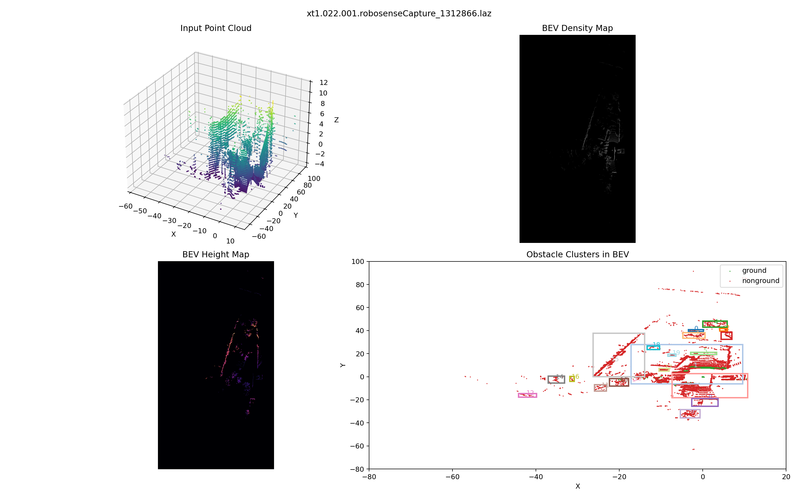

# LiDAR BEV Obstacle Detection

Standalone portfolio project for LiDAR obstacle detection using Bird's Eye View features.

The pipeline loads raw point clouds, crops the scene, removes the ground plane with RANSAC, clusters non-ground points, builds BEV density and height maps, and saves both visual and structured outputs.

## Highlights

- Supports `.las`, `.laz`, and `.bin` point cloud files
- Crops the cloud to a configurable region of interest
- Removes the ground plane with RANSAC
- Clusters obstacles with a lightweight DBSCAN-style algorithm
- Generates BEV density and height maps
- Saves output PNGs and JSON summaries
- Supports single-file and batch processing modes

## Sample Output

Example visualization generated from `xt1.022.001.robosenseCapture_1312866.laz`:



Example structured result:

- [Sample JSON summary](outputs/xt1.022.001.robosenseCapture_1312866_summary.json)

## Project Structure

```text
projects/
  lidar_bev_obstacle_detection/
    README.md
    run.py
    requirements.txt
    configs/
      default.json
    outputs/
    src/
      __init__.py
      io_utils.py
      pipeline.py
      visualization.py
```

## Processing Pipeline

1. Load a point cloud from `.las`, `.laz`, or `.bin`
2. Crop the point cloud to the target spatial range
3. Estimate the ground plane with RANSAC
4. Split points into `ground` and `non-ground`
5. Cluster obstacle points in XY space
6. Build BEV density and height maps
7. Save visualization and summary files

## Installation

From the repository root:

```bash
pip install -r projects/lidar_bev_obstacle_detection/requirements.txt
```

## Quick Start

Single file:

```bash
python3 projects/lidar_bev_obstacle_detection/run.py \
  --file data/LIDAR/lidar/xt1.022.001.robosenseCapture_1312866.laz
```

Batch mode:

```bash
python3 projects/lidar_bev_obstacle_detection/run.py \
  --input-dir data/LIDAR/lidar
```

Batch mode with a limit for demos:

```bash
python3 projects/lidar_bev_obstacle_detection/run.py \
  --input-dir data/LIDAR/lidar \
  --max-files 5
```

Summary-only mode without PNG rendering:

```bash
python3 projects/lidar_bev_obstacle_detection/run.py \
  --input-dir data/LIDAR/lidar \
  --summary-only
```

## CLI Flags

- `--file` path to one point cloud file
- `--input-dir` path to a directory of point clouds
- `--config` path to a JSON config file
- `--output-dir` where PNG and JSON results are saved
- `--recursive` recursively search subdirectories in batch mode
- `--max-files` process only the first `N` files in batch mode
- `--skip-existing` skip scans whose outputs already exist
- `--summary-name` custom filename for the aggregated batch summary
- `--summary-only` skip PNG rendering and save JSON outputs only

## Outputs

The pipeline writes results into `projects/lidar_bev_obstacle_detection/outputs/`:

- `<scan_name>_bev_detection.png`
- `<scan_name>_summary.json`
- `batch_summary.json` or a custom name passed via `--summary-name`

Each JSON summary contains:

- source file path
- total point count
- ground / non-ground point counts
- estimated ground plane coefficients
- detected obstacle cluster statistics

## Configuration

The default configuration lives in [configs/default.json](configs/default.json) and controls:

- crop bounds in `x`, `y`, `z`
- maximum number of loaded points
- BEV map resolution
- RANSAC iterations and distance threshold
- density clustering thresholds

## Main Files

- [run.py](run.py): command-line entry point
- [src/io_utils.py](src/io_utils.py): point cloud loading
- [src/pipeline.py](src/pipeline.py): crop, ground removal, clustering, BEV maps
- [src/visualization.py](src/visualization.py): PNG and JSON export
