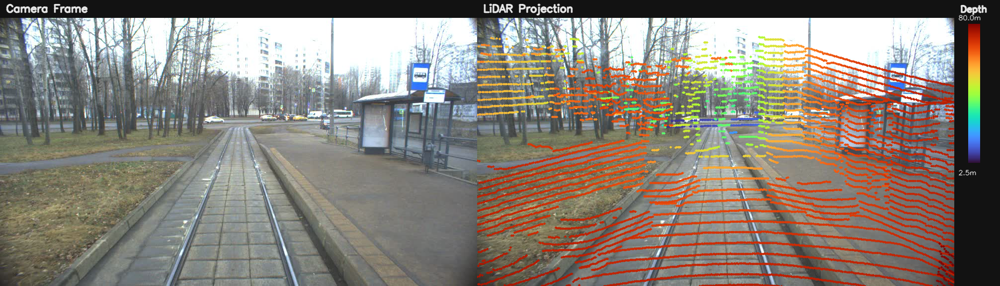

# LiDAR-to-Camera Projection and Sensor Fusion Visualization

Standalone portfolio project for projecting 3D LiDAR points into a 2D camera image using calibration data.

This project demonstrates a basic sensor-fusion workflow:

- load a camera frame
- load a LiDAR point cloud
- read camera calibration
- transform 3D points into the camera coordinate system
- project the points into image space
- color points by depth
- save the overlay image and a JSON summary

## Sample Output

Example overlay generated with the default configuration:



## Highlights

- Supports `.las`, `.laz`, and `.bin` point clouds
- Supports image input or frame extraction from video
- Uses the repository camera calibration format
- Colors projected points by distance
- Saves a side-by-side visualization for easy inspection

## Project Structure

```text
projects/
  lidar_camera_projection/
    README.md
    run.py
    requirements.txt
    configs/
      default.json
    outputs/
    src/
      __init__.py
      io_utils.py
      projection.py
      visualization.py
```

## Quick Start

From the repository root:

```bash
python3 projects/lidar_camera_projection/run.py
```

Explicit inputs:

```bash
python3 projects/lidar_camera_projection/run.py \
  --video-file data/city/trm.169.007.avi \
  --frame-index 0 \
  --point-cloud data/LIDAR/lidar/xt1.022.001.robosenseCapture_1312866.laz \
  --calib-file data/city/leftImage.yml
```

Batch mode for a LiDAR folder:

```bash
python3 projects/lidar_camera_projection/run.py \
  --input-dir data/LIDAR/lidar \
  --max-files 5
```

JSON-only mode:

```bash
python3 projects/lidar_camera_projection/run.py --summary-only
```

## Outputs

The script writes results into `projects/lidar_camera_projection/outputs/`:

- `<scan_name>_camera_overlay.png`
- `<scan_name>_projection_summary.json`
- `batch_summary.json` when `--input-dir` is used

## Notes

- This project uses the existing repository calibration convention from `srccam`.
- The default configuration uses a frame from `data/city/trm.169.007.avi` and a LiDAR scan from `data/LIDAR/lidar/`.
- It is intended as a calibration/projection/sensor-fusion visualization project, not a time-synchronized benchmark.

## Main Files

- `run.py` — command-line entry point
- `src/io_utils.py` — camera frame, point cloud, and calibration loading
- `src/projection.py` — coordinate transforms and 3D-to-2D projection
- `src/visualization.py` — overlay rendering and JSON export

## Useful Batch Flags

- `--input-dir` process a whole folder of LiDAR scans
- `--recursive` search subdirectories in batch mode
- `--max-files` limit the number of processed scans
- `--skip-existing` skip scans whose outputs already exist
- `--summary-name` choose a custom filename for the aggregated batch summary
